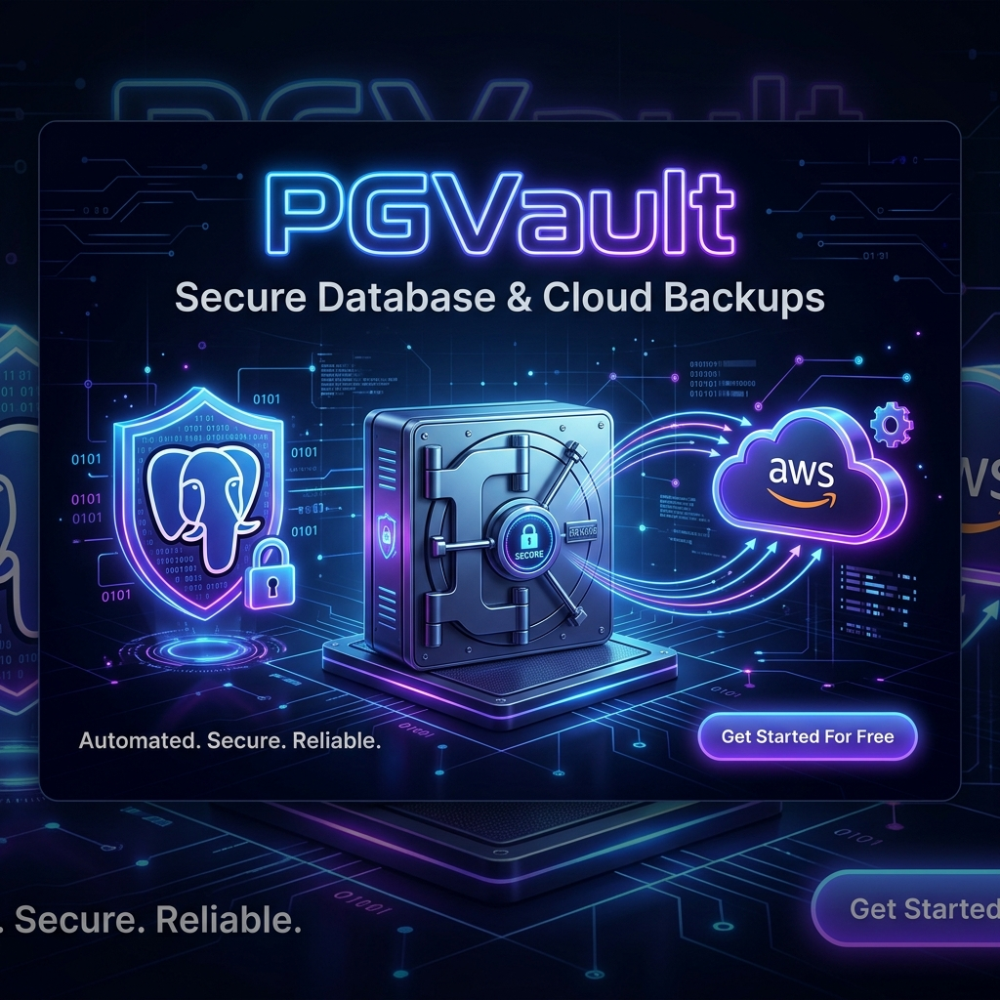

<div align="center">
  

  <br />
  <br />

  **A sleek, ultra-secure, and automated backup solution for PostgreSQL databases.**

  <p align="center">
    
    
    
    
    
    
  </p>
</div>

---

## 🌟 Overview

**PGVault** is a modern, web-based database management tool designed to take the headache out of database backups. Whether you are running a single database or managing a fleet of applications, PGVault provides a beautiful, unified interface to automate, encrypt, and securely store your PostgreSQL backups across multiple cloud providers.

Gone are the days of writing custom bash scripts, setting up brittle crontabs, or manually downloading SQL dumps. With PGVault, you configure it once through our beautiful UI, and let the system handle the rest.

---

## 🚀 Key Features

### 🛡️ Uncompromising Security
- **Magic Login:** Passwordless authentication using one-time passcodes (OTP) delivered securely via Email or SMS.
- **Military-Grade Encryption:** Backups can be compressed and encrypted using 7zip AES-256 encryption before they ever leave your server.
- **Secure Architecture:** Designed with isolated internal components to prevent unauthorized access. The backend APIs use strict session validation.

### ☁️ Multi-Cloud Destinations
Don't put all your eggs in one basket. PGVault can simultaneously distribute your backups to multiple locations:
- **Local Storage:** Keep a copy directly on the server's hard drive.
- **Amazon S3:** Stream backups to AWS S3, Wasabi, DigitalOcean Spaces, or any S3-compatible object storage.
- **Google Drive:** Seamlessly authorize PGVault to automatically organize your backups into Google Drive folders.

### ⏱️ True Automation
- **Cron Scheduling:** Set precise backup schedules using standard cron syntax directly from the UI.
- **Automated Retention:** Keep your storage costs low! Tell PGVault how many days of backups you want to keep, and it will automatically prune old, expired backups across all of your cloud destinations.

### 🎨 Beautiful, Responsive UI
- Built with **Next.js**, **Tailwind CSS**, and **Lucide Icons** to provide a state-of-the-art dark mode experience.
- Interactive charts and visual logs keep you informed about the health of your backups at a glance.

---

## 🏗️ Architecture

PGVault consists of three containerized services orchestrated by Docker:
1. **Frontend (`:3000`)**: A blazing fast Next.js application that provides the user interface.
2. **Backend (`:3001`)**: A robust Node.js Express server that interfaces with `pg_dump`, handles the heavy lifting of encryption, and manages the cloud provider APIs.
3. **Database**: A lightweight MySQL container specifically dedicated to securely storing PGVault's internal user configurations and backup logs.

---

## ⚡ Quickstart Deployment Guide

Because PGVault is fully containerized and published to Docker Hub, deploying to a brand new Ubuntu server is incredibly simple. You do not need to install Node.js, PM2, or manually build any code.

### 1. Install Docker & Docker Compose
Connect to your new server via SSH and run this command to install Docker:
```bash
sudo apt update
sudo apt install -y docker.io docker-compose
```

### 2. Download the Compose File
You strictly just need the `docker-compose.yml` file. Create a directory and download it:
```bash
mkdir pgvault
cd pgvault
wget https://raw.githubusercontent.com/Haris-khan-Durrani/PGVault-Core/main/docker-compose.yml
```

### 3. Start the Vault
Run the following command to pull the images from Docker Hub and start the application:
```bash
sudo docker-compose up -d
```

### 4. Done!
That's it! Docker will pull your pre-compiled frontend and backend images, set up the internal database, and link them all together automatically.

Navigate to `http://<your-server-ip>:3000` and use your Magic Login to access your vault!

---

## 🔄 Updating the App
When new features are added to the `PGVault-Core` repository, GitHub Actions will automatically publish the new versions. To update your live server to the latest version, simply run:
```bash
cd pgvault
sudo docker-compose pull
sudo docker-compose up -d
```
